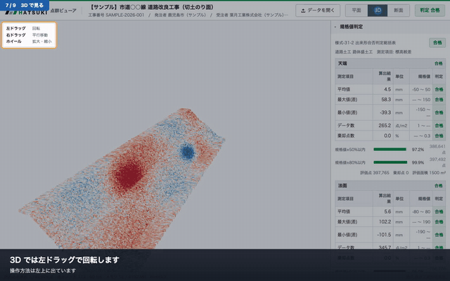

# 点群ビューア


土木工事の出来形点群を、**発注者が特別なソフトを入れずにブラウザだけで開いて**、
設計との差分と規格値判定まで確認できる形にして渡すための道具。
葉月工業株式会社（<https://hatsuki.co.jp/>）。

工区ごとに「データ一式＋ビューア」をフォルダで固めて渡すと、
受け取った側はブラウザで開くだけで見られる。

| | |
|---|---|
| **デモ** | <https://ryujiyasu.github.io/tengun-viewer/>（合成サンプル。開くと動作確認が出る） |
| **使い方** | [docs/使い方.md](docs/使い方.md)・[動画](docs/guide/使い方.mp4) |
| **実測値** | [docs/P0-実測結果.md](docs/P0-実測結果.md) |
| **要領との対応** | [docs/要領との対応.md](docs/要領との対応.md) |

## できること

- 点群の表示（平面図・3D・断面）。**初期表示は平面図**
- 設計 LandXML との較差をカラーマップで表示
- 出来形合否判定総括表（様式-31-2 準拠）の作成と CSV 出力
- ブラウザに LAS/LAZ と設計データを放り込んで、その場で計算（CLI 不要）
- **起動時に、その PC で動くかを判定して表示する**
- WebGL2 が使えない環境では Canvas 2D に自動で落ちる



## 使い方

### 準備

```sh
npm install
npm run build          # ビューアをビルド（先に必要）
```

### サンプルデータを作る

実データが無くても動かせる。鹿児島市内・平面直角座標系第II系に置いた
小段付き切土のり面を合成する。

```sh
npm run sample                      # 200 万点（本番規模）
node tools/make-sample.mjs --out fixtures --points 60000 --seed 7   # 試験用の小さいもの
```

### 変換する

```sh
node packages/cli/src/ptv.js build \
  --post   出来形.las \
  --pre    起工測量.las \
  --design 設計.xml \
  --info   工事情報.json \
  --out    ./dist/工事番号/
```

出力。

```
dist/工事番号/
  full/             閉域 Web サーバに置く版（octree 分割）
    index.html
    data/*.bin
    report/*.csv, *.svg
  light/
    index.html      file:// でそのまま開ける単一 HTML
  manifest.json     データの来歴（各ファイルの SHA-256 付き）
  build-report.json 変換の所要時間と容量の実測値
```

主なオプション。

| オプション | 既定 | 内容 |
|---|---|---|
| `--profile full\|light\|both` | `both` | 出力する版 |
| `--measure elevation\|horizontal\|normal` | `elevation` | 判定に使う較差の方式 |
| `--work-type <id>` | 工事情報の `workType` | 規格値定義の工種 |
| `--slope-threshold <deg>` | `15` | 法面とみなす勾配 |
| `--light-points <n>` | `1200000` | 軽量版の目標点数 |
| `--all-classes` | — | 分類によらず全点を判定に使う（既定は地表面 2, 11 のみ） |
| `--skip-normal` | — | 表示用の法線方向較差を計算しない |

### 渡す

- **発注者に渡す**: `light/index.html` を 1 ファイル渡す。ダブルクリックで開く
- **庁内サーバに置く**: `full/` をそのまま配置する
- `full/index.html` を file:// で開くと、CORS で読めない旨と軽量版を使うよう案内が出る

## 工事情報 JSON

座標系は LAS のヘッダに入っていないことが多いので、**推測せず明示指定する**。

```json
{
  "projectName": "市道○○線 道路改良工事",
  "projectNumber": "2026-001",
  "owner": "鹿児島市",
  "contractor": "葉月工業株式会社",
  "startDate": "2026-04-01",
  "endDate": "2026-11-30",
  "workType": "doro-dokou-rotai",
  "epsg": 6670,
  "axisOrder": "EN",
  "design": { "file": "設計.xml", "pointOrder": "NEH" }
}
```

`axisOrder` は LAS の X/Y の並び。

- `EN` — X が東・Y が北（一般的な LAS）
- `NE` — X が北・Y が東（測量座標をそのまま入れた場合）

日本の公共座標は X=北 / Y=東、LAS は X=東 / Y=北。**取り違えると工区が 90 度回る。**
点群と設計面が平面上で重なっていない場合は警告を出す。

`design.pointOrder` は LandXML の `<P>` の順。仕様上の既定は `NEH`（北 東 標高）。

## 規格値

`docs/spec-values.json` に外出ししてある。要領が改定されたらこのファイルだけ差し替える。
**コードに数値を書かないこと。**

> **注意**: 同梱の数値は要領の様式記載例から読み取った参考値で、規格値表そのものではない。
> `source.verified` が `false` の間は、画面と CSV の両方に出典未確認の警告が出る。
> 検査に使う前に、適用される施工管理基準の値へ差し替えること。

## 試験

```sh
npm test                # core の単体試験 8 項目（較差の解析解との一致など）
npm run verify          # 実機の Chrome で 24 項目（ビルド済みのサンプルが要る）
npm run verify:import   # 取り込み機能 9 項目（CLI との判定値一致を含む）
npm run verify:controls # 表示設定が実際に画面へ反映されるか 18 項目
npm run verify:live     # 公開URLで実際に動くか 9 項目
```

`verify` は PC にインストール済みの Chrome / Edge を使う。
`CHROME_PATH` で明示指定もできる。

## 構成

```
packages/
  core/     差分計算・規格値判定・座標変換・LAS/LandXML。依存ゼロ、環境非依存
  cli/      点群変換とパッケージ生成（ptv）
  viewer/   ブラウザ側アプリ（three.js）
brand/      ロゴ素材（葉月工業株式会社）
fixtures/   試験用の小さな点群と LandXML
docs/       規格値定義・使い方・調査結果
site/       （廃止）公開サイトは full 版をそのまま置く
tools/      サンプル生成・検証・実測・使い方動画の収録
```

差分計算と規格値判定は `core` に閉じ込めてあり、CLI とブラウザの両方が同じコードを通る。
**取り込みでも変換でも判定値が変わらないことを自動試験で確認している。**

## 設計上の決めごと

- **外部 CDN に依存しない。** 閉域網では読めない
- **判定・統計は常に全点で計算する。** 間引きは描画用の octree だけが行い、数字には触れない
- **精度に関わる数値をハードコードしない。** 規格値・許容値・色域は設定ファイルに出す
- **内部計算は倍精度。** float32 に落とすのは GPU に渡す直前だけ
- **較差の符号は設計面より高い側が正。** 画面にも明示する
- **GPU に渡す前にローカル原点へ平行移動する。** 平面直角座標系の生値を float32 で渡すと描画が壊れる
- **ビューアは読み取り専用。** 納品データを改変できると検査資料としての信頼性が落ちる
- **three.js のユニフォームは `uniformsNeedUpdate` を立てて送り直す。** 同じマテリアルを共有する描画では再送されず、表示設定が効かなくなる
- **描画の確認はページ内の canvas 読み出しでなく、スクリーンショットで行う。** WebGL は `preserveDrawingBuffer` なしだと空の画像が返り、真っ黒な画面を見て試験が通ってしまう

## 作らないもの

- 点群の取得・SfM 処理（Metashape 等に任せる）
- ノイズ除去・フィルタリング（前処理済みデータを入力とする）
- サーバサイドの認証・ユーザ管理（配布型のため不要）
- BIM/CIM モデル（IFC）の表示
- 施工中のリアルタイム進捗管理
- ローカル HTTP サーバ同梱の実行ファイル（持ち込みが禁止されている環境で使えない）
