# 点群ビューア 使い方

> このファイルは、工事の出来形点群を**確認する側**（発注者の技術職員の方）向けに書いています。
> 3D の操作に慣れていなくても使えるようにしてあります。

**動画で見る**: [使い方.mp4](guide/使い方.mp4)（2分20秒・音声なし）

---

## はじめに

渡された HTML ファイルを**ダブルクリックするだけ**で開きます。
ソフトのインストールも、インターネット接続も要りません。

閲覧専用です。**データを書き換えることはできません。**

---

## 1. 開いたときに出るもの

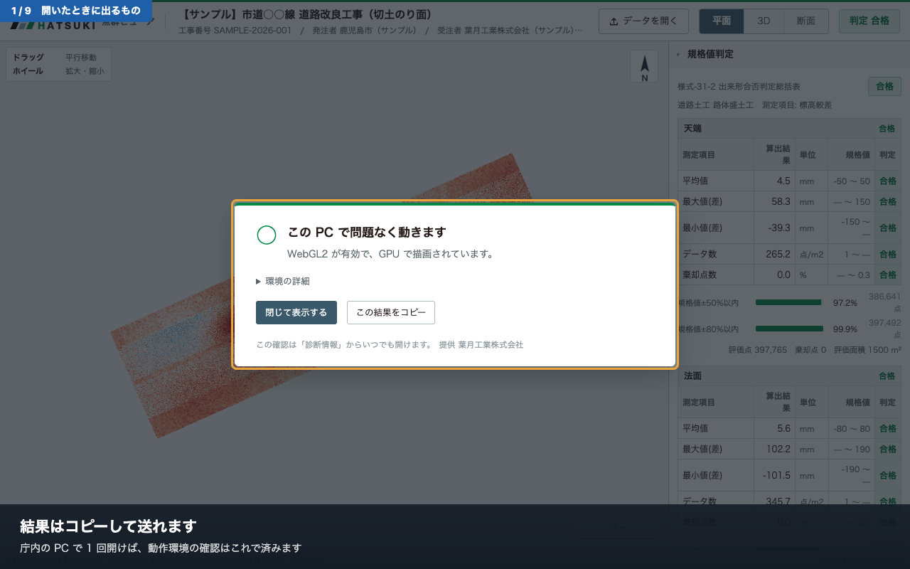

開くと最初に、**その PC で正しく表示できるか**の確認が出ます。

| 表示 | 意味 | どうするか |
|---|---|---|
| ○ | 問題なく動きます | そのまま「閉じて表示する」 |
| △ | 表示できるが動作が遅い | 画面の手順でブラウザの設定を直すと速くなります |
| × | 3D は使えません | 平面図・断面図・帳票は見られます。そのままお使いいただけます |

「この結果をコピー」を押すと内容を書き出せます。
うまく表示されないときは、この内容をそのままお送りください。

この確認は、右側の「診断情報」からいつでも開き直せます。

---

## 2. 画面の見かた

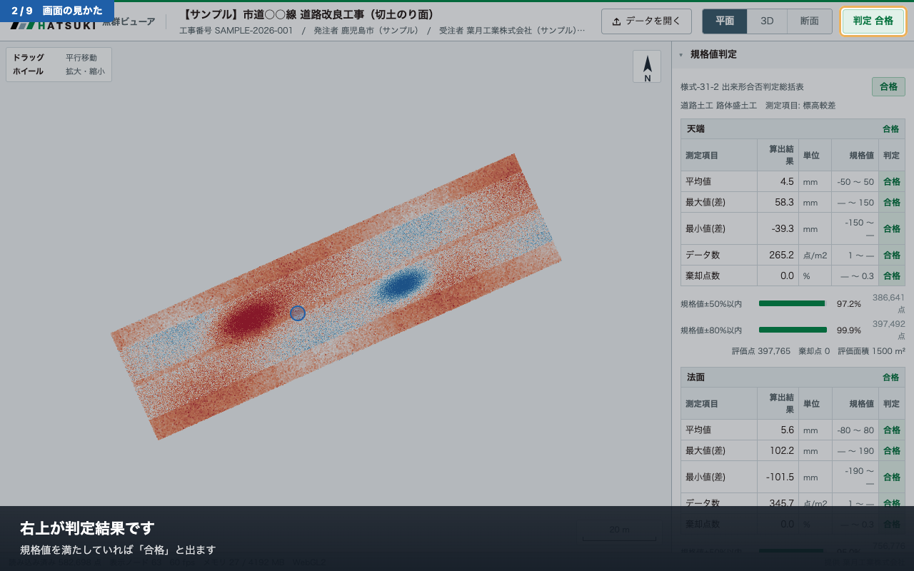

| 場所 | 内容 |
|---|---|
| 上・左 | 工事名、工事番号、発注者、受注者、工期 |
| 上・右 | **判定結果**（合格／異常値有） |
| 中央 | 図（最初は平面図） |
| 右 | 規格値判定、表示設定、帳票など |
| 左上 | 操作方法 |
| 右下 | 縮尺／方位 |

---

## 3. 色の見かた

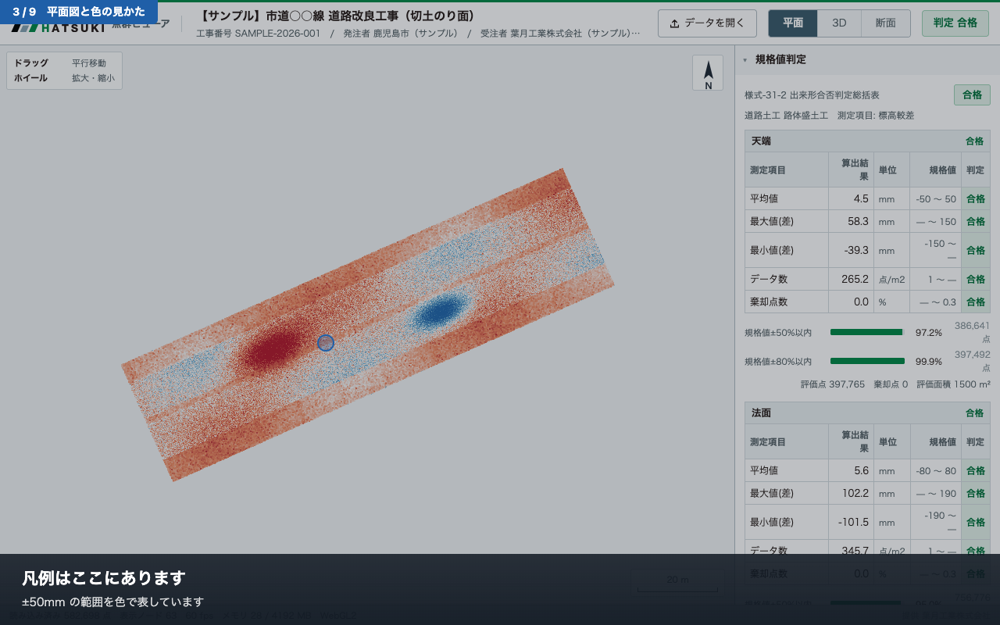

点の色は、**設計面とのズレの大きさ**を表します。

- **赤** … 設計面より **高い**（盛り気味）
- **白** … 設計どおり
- **青** … 設計面より **低い**（削り気味）

色の濃さが濃いほどズレが大きくなります。既定は ±50mm の範囲です。

> 上の例では、左寄りの濃い赤が盛り気味の箇所、中ほどの青が削りすぎの箇所です。
> **どこを見に行けばよいかが、図を見た時点で分かります。**

---

## 4. 動かしかた

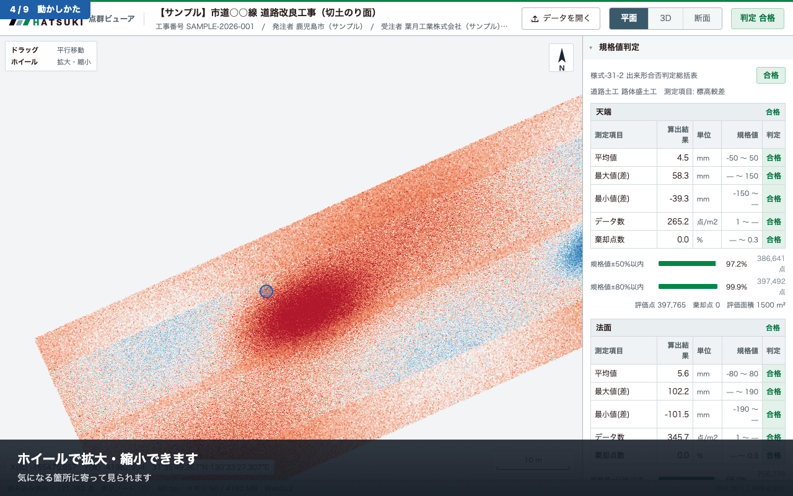

操作方法は**画面の左上に常に出しています**。

**平面図のとき**

| 操作 | 動き |
|---|---|
| ドラッグ | 図を動かす |
| ホイール | 拡大・縮小 |

**3D のとき**

| 操作 | 動き |
|---|---|
| 左ドラッグ | 回転 |
| 右ドラッグ | 平行移動 |
| ホイール | 拡大・縮小 |

マウスを図の上に置くと、その地点の**座標（X 北・Y 東）と緯度経度**が左下に出ます。

---

## 5. 色の範囲を変える

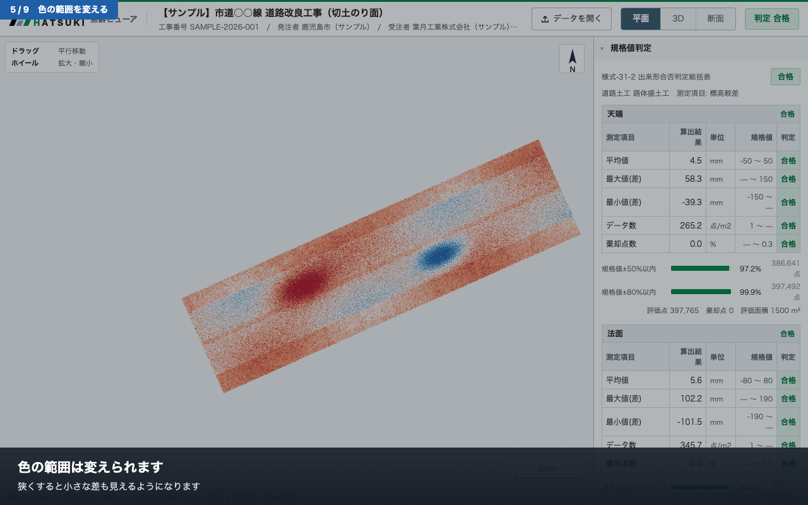

右側の「表示」→「色域」のつまみで、色で表す範囲を変えられます。

- **狭くする**（例 ±10mm）… わずかな差も色に出ます。仕上がりのムラを見るとき
- **広くする**（例 ±150mm）… 大きな差だけが目立ちます。全体の傾向を見るとき

**この操作で判定の数値は変わりません。** 色の付け方が変わるだけです。

---

## 6. 規格値の判定

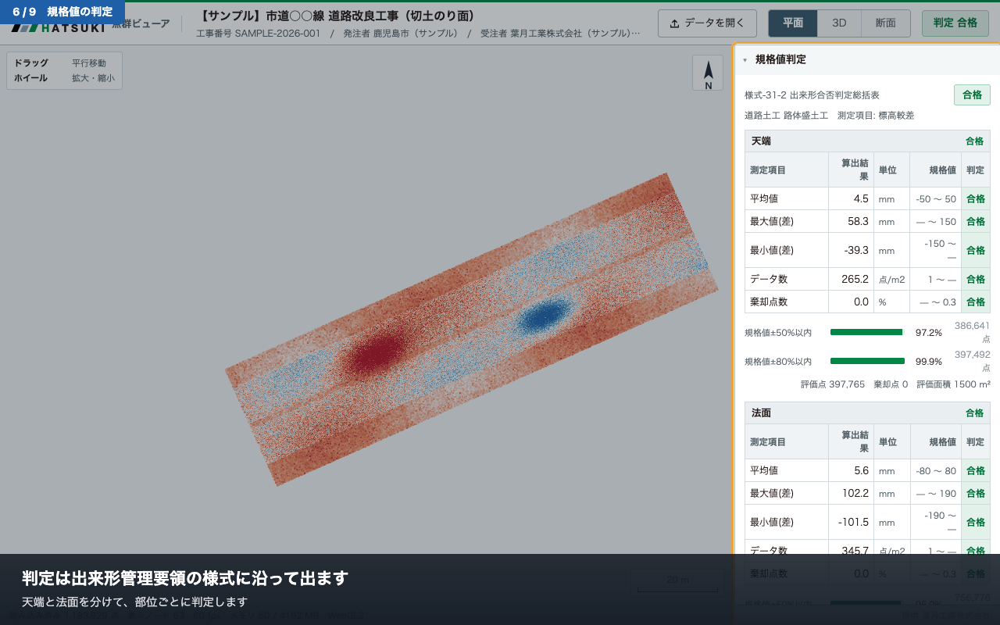

右側のいちばん上に、**出来形合否判定総括表**が出ます。
国土交通省「３次元計測技術を用いた出来形管理要領（案）」の様式-31-2 に沿った並びです。

**天端と法面は分けて判定します**（規格値が違うため）。

| 測定項目 | 内容 |
|---|---|
| 平均値 | 較差の平均。棄却点を除いた値 |
| 最大値(差) / 最小値(差) | 棄却点を除いた最大・最小 |
| データ数 | 1 ㎡ あたりの計測点数 |
| 棄却点数 | 規格値を大きく外れた点の割合 |
| 規格値±50% / ±80% 以内 | ばらつきの目安 |

> **ご注意**
> 同梱している規格値は、要領の様式記載例から読み取った**暫定値**です。
> 画面と CSV の両方に「出典未確認」の注意書きが出ます。
> 検査にお使いになる前に、適用される施工管理基準の値と照合してください。

---

## 7. 3D で見る

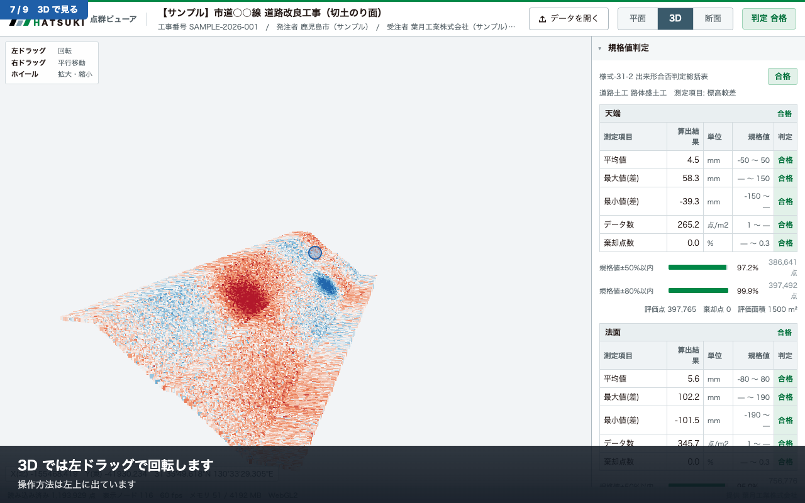

上の「3D」タブで切り替わります。法面の形状や、ズレの広がりを立体的に確認できます。

既定では**地表面だけ**を表示しています（判定に使っているのと同じ範囲です）。
「表示」→「地表面のみ表示」のチェックを外すと、除去しきれなかった草木なども表示されます。

---

## 8. 断面をつくる

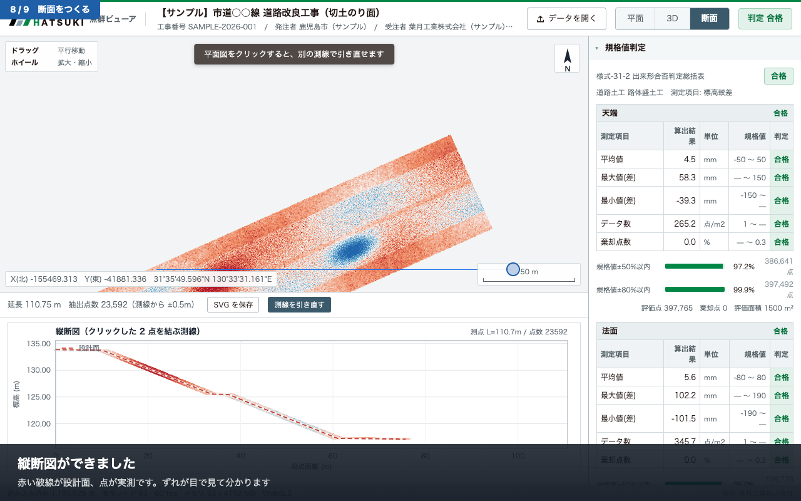

1. 上の「**断面**」タブを押します
2. 平面図の上で **① 始点**をクリック
3. **② 終点**をクリック

その 2 点を結ぶ線で切った**縦断図**が下に出ます。

- **赤い破線** … 設計面
- **点** … 実測（色は較差）
- 縦軸は**現地の標高**です

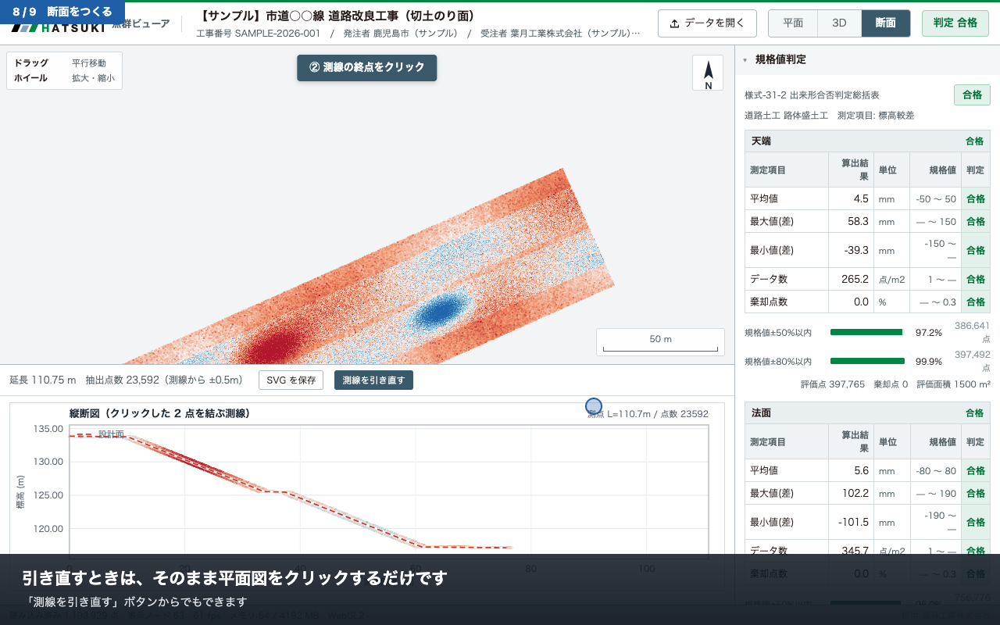

**引き直すときは、そのまま平面図をもう一度クリックするだけ**です。
「測線を引き直す」ボタンからでもできます。

「SVG を保存」で図を書き出せます。そのまま帳票に貼れます。

---

## 9. 帳票を出す

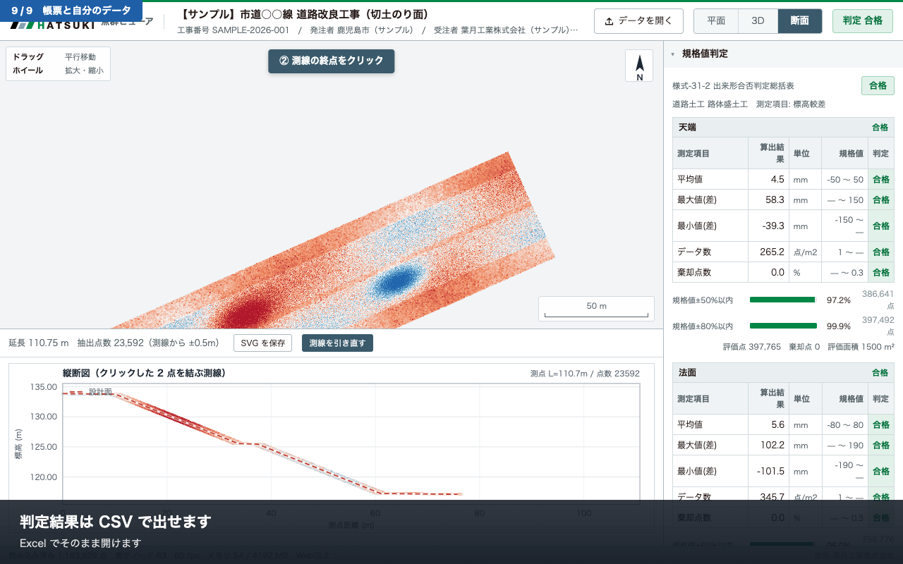

右側の「帳票」から CSV を保存できます。Excel でそのまま開けます。

| ファイル | 内容 |
|---|---|
| 出来形合否判定総括表.csv | 様式-31-2 に沿った判定結果 |
| histogram.csv | 較差の度数分布 |
| 土量.csv | 掘削・盛土量の概算（起工測量データがある場合） |

> 土量は格子標高差による概算です。**数量計算書の代わりにはなりません。**

---

## 10. 自分のデータを読み込む

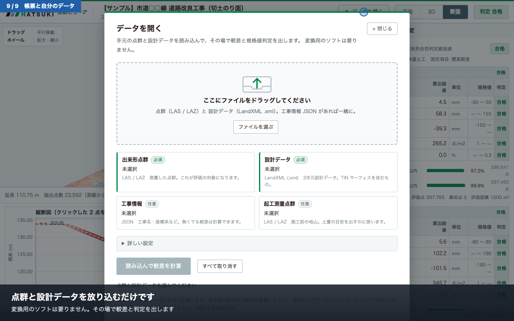

右上の「**データを開く**」から、手元の点群と設計データを読み込めます。
変換用のソフトは要りません。

1. 点群（**LAS または LAZ**）と 設計データ（**LandXML .xml**）をドラッグ
2. 「読み込んで較差を計算」を押す

工事情報 JSON があれば一緒に入れてください（工事名・座標系が入ります）。

- **判定・統計は間引かずに全点で計算します。** 表示用の間引きは数値に影響しません
- 読み込んだデータは**この PC のブラウザ内だけで処理**され、どこにも送信されません
- 200 万点（約 50MB）で 15 秒程度が目安です

---

## うまくいかないとき

| 症状 | 原因と対処 |
|---|---|
| 画面が真っ白／点が出ない | ファイルが途中までしかコピーされていない可能性があります。フォルダごと受け取り直してください |
| 「この版は file:// では開けません」と出る | Web サーバ用の版です。**単一 HTML 版**（light）の方を開いてください |
| 動きがカクカクする | 起動時の確認が「△」になっていないか確認してください。ブラウザのハードウェアアクセラレーションが切れている可能性があります |
| 「WebGL2 が使えません」と出る | 3D は使えませんが、平面図・断面図・帳票はそのままご覧いただけます |
| 点群と設計面がずれている | 座標系または軸の並びの指定違いが考えられます。データの提供元にご確認ください |

解決しないときは、起動時の確認画面（または「診断情報」）の内容をコピーしてお送りください。

---

提供　**葉月工業株式会社**　<https://hatsuki.co.jp/>

